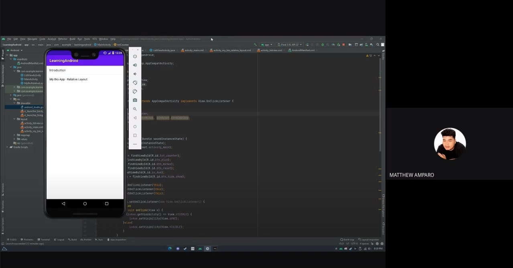
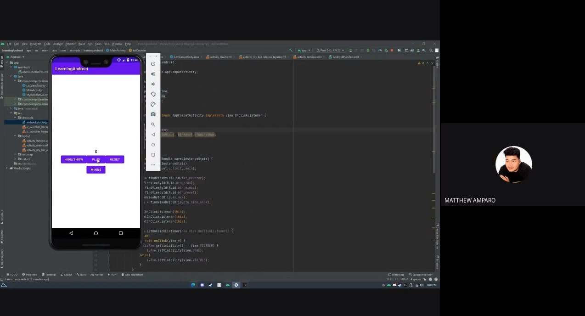
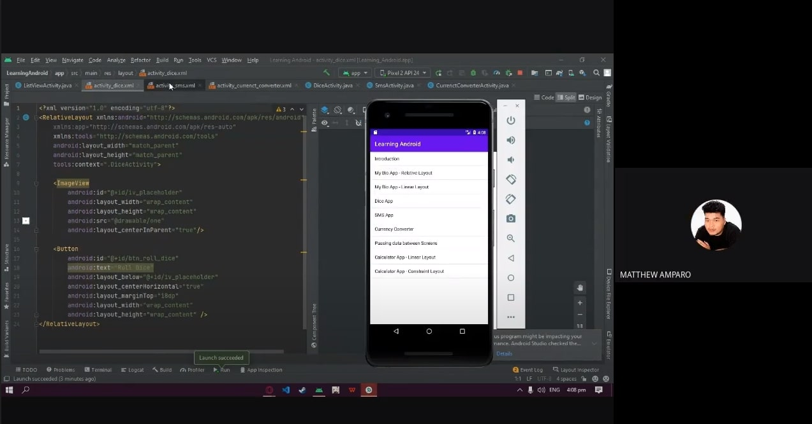

#Prelim Exam
<html>
<head>
	<title>The Bond of Jing</title>
	<!-- css files -->
	<link rel="stylesheet" href="https://maxcdn.bootstrapcdn.com/font-awesome/4.6.3/css/font-awesome.min.css">
	<link rel="stylesheet" type="text/css" href="https://cdnjs.cloudflare.com/ajax/libs/bulma/0.3.1/css/bulma.min.css">
	<link rel="stylesheet" type="text/css" href="assets/css/styles.css">

	<link rel="icon" type="image/x-icon" href="assets/img/favicon.png">
	<meta name="author" content="Giuseppe Adams Damasin">
	<meta name="viewport" content="width=device-width, initial-scale=1.0">
</head>
	<body>
		<!-- Navbar -->
		<nav class="nav container void-background">
			<!-- This "nav-menu" is hidden on mobile -->
			<!-- Add the modifier "is-active" to display it on mobile -->
			
			

				<a class="nav-item" href="#about">About</a>
				<a class="nav-item" href="#projects">Projects</a>
				<a class="nav-item" href="#social">Social</a>
			

			<!-- This "nav-toggle" hamburger menu is only visible on mobile -->
			<!-- You need JavaScript to toggle the "is-active" class on "nav-menu" -->
			
				
				
				
			
		</nav>
				
		<!-- About Me -->
		<section id="about" class="section section-1">
			

				

					<h1>The Bond of Jing</h1>
				

				
				
				 
				
				
			

			
 
				

					Bond of Jing is a team of soon to be developers striving hard to commit success and achieve goals as a contributor in the technological aspect in the society
				

			

		</section>
		
		<!-- Projects -->
		<section  id="projects" class="section section-2">
			

				

					<h3 class="title is-3">Tasks compilation</h3>
				

				
				

					<figure>
						
						
						
						
						
					</figure>
				

				

			

		</section>

		<!-- Footer -->
		<section class="section-4 has-text-centered container">
			<a href="https://www.facebook.com/profile.php?id=100069148569336">Joshua Andre Gonzales</a>
			 
			 
			<a href="https://www.facebook.com/amparomatthew">Matthew Amparo</a>
			 
			 
			<a href="https://www.facebook.com/Damseppe">Giuseppe Adams Damasin</a>
		</section>
		
		<!-- Scripts  -->
				
	</body>	
</html>
